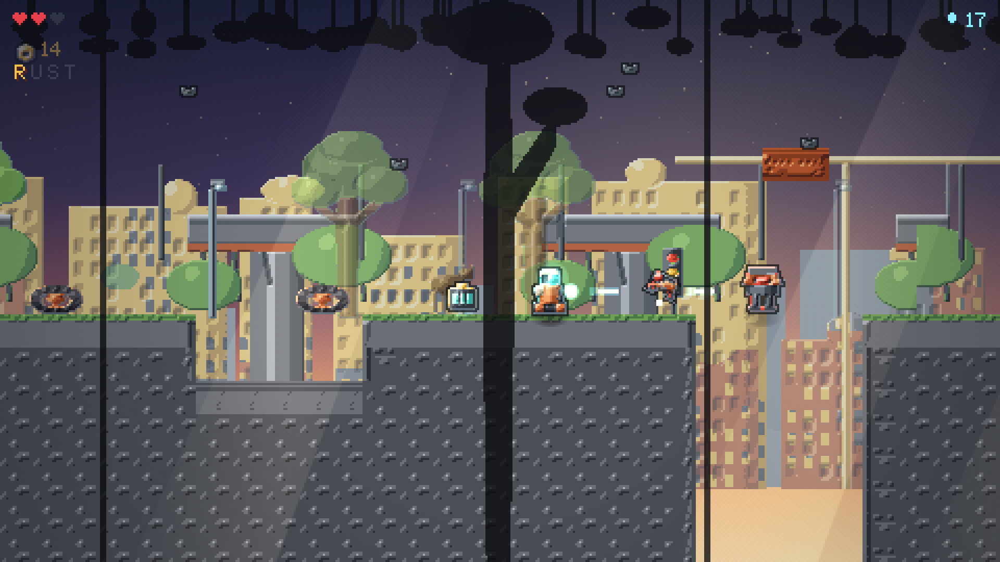

# RUST COUNTRY

A single-level browser platformer in the spirit of *Donkey Kong Country*. You are
**SCRAP**, a small robot alone on a dead Earth. Six beats, start to finish,
ending in a boss fight with **THE WARDEN**.

One HTML file. No build step, no dependencies, no network. Double-click it and
it plays.



## Play

Open `rust-country.html` in Chrome or Edge.

It works straight from the filesystem, but a local server is better — browsers
handle `localStorage` inconsistently on `file://`, so served is where your best
times actually stick:

```
python -m http.server 8000
```

Then open <http://localhost:8000/rust-country.html>.

On a phone, serve it from a machine on the same Wi-Fi and open that address.
The touch controls appear automatically.

## Controls

**Keyboard**

| Key | |
|---|---|
| `WASD` / arrows | move — hold **up** to aim the laser upward |
| `Space` | jump — again in the air to double jump |
| `Shift` | boost roll — jump mid-roll to clear big gaps |
| `X` | fire the laser |
| `Z` | servo stomp — or just land on anything from above |
| `S` / down | duck under beams on the rail cart |
| `R` · `M` · `Esc` | retry section · sound · pause menu |

**Phone** — D-pad, `A` jump, `B` roll, `Y` laser, `X` stomp. Turn the phone
sideways for a bigger picture.

## How it works

Canvas 2D at a fixed 480×270, integer-scaled. Physics runs a fixed 60Hz step
decoupled from rendering, so it behaves identically on a fast machine and a slow
one. Every sprite, tile and parallax layer is drawn procedurally in code and
pre-rendered to an offscreen atlas at boot — there are no image files anywhere.
All audio is Web Audio synthesis. Roughly 6,000 lines in one file.

The look comes from lighting rather than detail: each sprite is shaded from a
height map with a single light direction, a four-step ramp, a rim light and a
contact shadow. That is what makes flat pixels read as solid objects.

## Testing

Movement and level geometry are measured, not eyeballed. A headless Chrome
harness drives the real game one physics tick at a time and searches every
sensible input timing, so "cannot cross this gap" means no timing crosses it.

This was not optional. Most of the serious bugs in this project were invisible
in a screenshot — an unfinishable level, a boss that never spawned, a weapon
that missed its only target by eight pixels. All of them rendered perfectly.

## Repository

| | |
|---|---|
| `rust-country.html` | the game, entire |
| `docs/TECHNICAL.md` | how it works: the loop, the lighting, the testing |
| `index.html` | redirect, so the bare URL lands on the game |

MIT licensed.

## Credits

Original throughout — no Nintendo names, characters, assets or music. The
influence is acknowledged; the IP is not touched. Tone reference is *WALL-E*.
